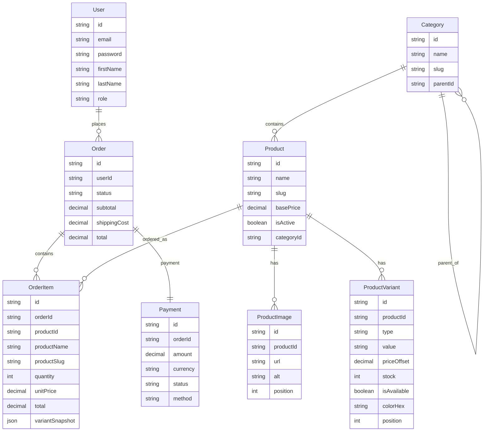

# Tatafil — Stack Next.js + Express + PostgreSQL

## Prérequis
- Node.js 20+
- Docker Desktop
- Git

## Lancement local

### 1. Base de données (Docker)
```bash
docker compose up -d
```

### 2. Backend
```bash
cd backend
npm install
npx prisma migrate dev --name init
npm run db:seed
npm run dev
```

### 3. Frontend
```bash
cd frontend
npm install
npm run dev
```

## URLs
- Frontend : http://localhost:3000
- Backend  : http://localhost:3001
- API Health : http://localhost:3001/api/health
- Prisma Studio : npx prisma studio (depuis backend/)

## Comptes de démo (après seed)
- Admin  : admin@boutique.fr / admin1234
- Client : client@example.fr / user1234


flowchart TD

    User --> Order

    Category --> Product

    Product --> ProductImage
    Product --> ProductVariant

    Order --> OrderItem
    Order --> Payment

    OrderItem -. référence catalogue .-> Product


